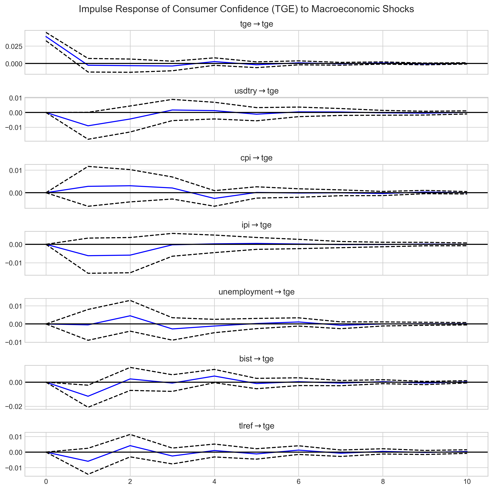

-blue)


---

# Consumer Confidence and Macroeconomic Dynamics in Turkey 

## Financial Time Series Modernization (V2)

This project extends the original **Financial Time Series Modernization** study.

The dataset has been expanded to include macroeconomic observations
covering the period **2019–2025**.

## A Vector Autoregression (VAR) Analysis (2019–2025)

### Impulse Response of Consumer Confidence



Figure: Impulse response of consumer confidence to macroeconomic shocks.

The impulse response functions illustrate how consumer confidence reacts to shocks in macroeconomic variables such as exchange rates, inflation, industrial production, financial markets, unemployment, and interest rates.

This repository presents an applied econometric analysis examining the dynamic relationship between **consumer confidence** and key **macroeconomic variables in Turkey**. The study employs a **Vector Autoregression (VAR) framework** implemented in Python to investigate how macroeconomic shocks influence consumer sentiment.

The analysis focuses on the period **2019–2025**, a time characterized by significant macroeconomic volatility, including the COVID-19 pandemic, exchange rate fluctuations, high inflation dynamics, and shifts in monetary policy.

---

# Project Motivation

Consumer confidence is widely regarded as a crucial indicator of households’ expectations about future economic conditions. Changes in consumer sentiment can affect:

- consumption behavior  
- savings decisions  
- investment expectations  
- overall economic activity  

In emerging economies such as Turkey, consumer expectations are often sensitive to changes in **exchange rates, inflation, financial markets, and interest rates**. Understanding the dynamic interactions between these macroeconomic variables and consumer confidence provides valuable insights for economic analysis and policy evaluation.

This project aims to analyze these relationships using **modern computational econometric methods implemented in Python**.

---

# Data

The dataset consists of **monthly macroeconomic observations for Turkey covering January 2019 – December 2025**.

The data were obtained from official statistical sources and financial databases and subsequently cleaned and structured for econometric analysis.

## Variables Used in the Model

| Variable | Description |
|--------|-------------|
| TGE | Consumer Confidence Index |
| USDTRY | Exchange Rate |
| CPI | Consumer Price Index |
| IPI | Industrial Production Index |
| UNEMPLOYMENT | Unemployment Rate |
| BIST | Borsa Istanbul Stock Market Index |
| TLREF | Turkish Lira Reference Interest Rate |

To ensure stationarity, the variables were transformed using **log-difference transformations**, representing growth rates or percentage changes.

---

# Methodology

The empirical analysis follows a standard **econometric time-series analysis pipeline**:

1. Data collection and dataset construction  
2. Exploratory time series analysis  
3. Stationarity testing using the **Augmented Dickey–Fuller (ADF) test**  
4. Log-difference transformations  
5. Lag order selection using **information criteria (AIC, BIC, HQIC)**  
6. Estimation of the **Vector Autoregression (VAR) model**  
7. **Granger causality analysis**  
8. **Impulse Response Functions (IRF)**  
9. **Forecast Error Variance Decomposition (FEVD)**  

The VAR framework allows each variable in the system to be modeled as a function of its own past values and the past values of all other variables in the system.

All computations are implemented in **Python using pandas, numpy, statsmodels, and matplotlib**.

## Research Workflow

The project follows a structured econometric research pipeline:

```
Data Collection (EVDS Macroeconomic Data)
        │
        ▼
Data Cleaning & Dataset Construction
        │
        ▼
Exploratory Data Analysis (EDA)
        │
        ▼
Stationarity Testing (ADF)
        │
        ▼
VAR Model Estimation
        │
        ▼
Granger Causality Analysis
        │
        ▼
Impulse Response Functions (IRF)
        │
        ▼
Forecast Error Variance Decomposition (FEVD)

```

# Key Findings

The empirical results provide several insights into the dynamic behavior of consumer confidence in Turkey:

- Macroeconomic variables jointly **Granger-cause changes in consumer confidence**.
- **Exchange rate shocks** generate noticeable short-run negative responses in consumer sentiment.
- **Financial market movements (BIST)** show statistically significant effects on consumer confidence.
- Consumer confidence exhibits **strong persistence**, as indicated by variance decomposition results.
- Most macroeconomic shocks produce **short-term effects that gradually dissipate over time**.

These findings suggest that **financial and macroeconomic developments play an important role in shaping consumer expectations** in emerging market economies.


# Repository Structure

```
TURKEY_MACRO_VAR_PROJECT
│
├── assets
│   └── irf_consumer_confidence.png
│
├── data
│   ├── raw
│   └── processed
│
├── notebooks
│   ├── 01_build_macro_dataset.ipynb
│   ├── 02_exploratory_analysis.ipynb
│   ├── 03_var_model.ipynb
│   ├── analysis.md
│   └── research_documentation.md
│
└── README.md
```


# Notebooks

## 01_build_macro_dataset.ipynb

Constructs the macroeconomic dataset by cleaning, aligning dates, and merging multiple macroeconomic time series.

## 02_exploratory_analysis.ipynb

Performs exploratory analysis including visualization, correlation analysis, and stationarity testing using ADF tests.

## 03_var_model.ipynb

Implements the VAR model and performs the main econometric analysis including:

- lag selection  
- Granger causality testing  
- impulse response analysis  
- variance decomposition  

---

# Tools and Libraries

The project is implemented in **Python** using:

- pandas — data manipulation  
- numpy — numerical computation  
- statsmodels — econometric modeling  
- matplotlib — visualization 

These tools allow for **reproducible econometric analysis** using open-source software.

---

# Project Type

This repository represents an **applied econometric case study** combining:

- financial time series analysis  
- macroeconomic data analysis  
- Python-based econometric modeling  

The goal is to demonstrate how modern data science tools can be used to conduct **reproducible econometric research**.

---

# Reproducibility

All results in this repository can be reproduced by running the notebooks in the following order:

1. 01_build_macro_dataset.ipynb  
2. 02_exploratory_analysis.ipynb  
3. 03_var_model.ipynb

---
